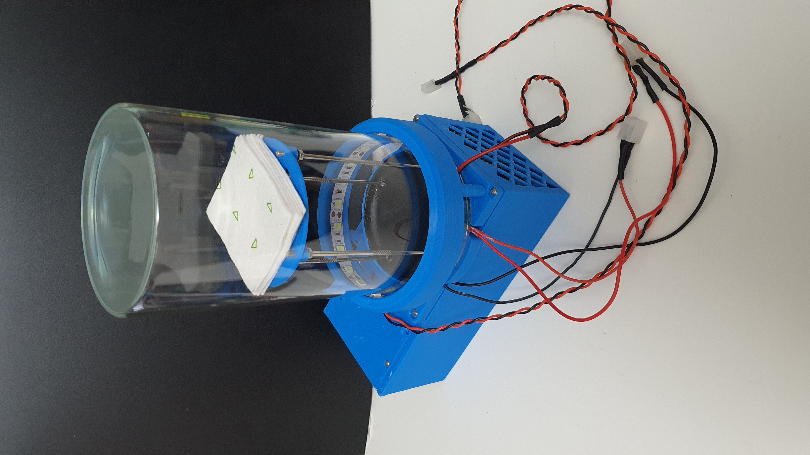

<h1  align="center"> Peltier Cloud Chamber </h1>

  

### Summary

### Contents
* 3D Model  
[On Shape](https://cad.onshape.com/documents/e24d3f0c59092dfada429e6a/w/2fb653e358505a46670996ee/e/9da5f6a65d5f518dba16bbf6?renderMode=0&uiState=620a0dbf09703926ef2a5f91)

* Circuit Diagram  
[KiCad 6](https://github.com/citizen-science-and-engineering/peltier-cloud-chamber/tree/main/circuit%20diagrams/temperature_monitor_pi_pico)

* Firmware  
[Temperature Monitor (Pi Pico)](https://github.com/citizen-science-and-engineering/peltier-cloud-chamber/tree/main/firmware/temperature_monitor_pi_pico)

#### Test run
Warning: Loud

Trace event can be seen around the 4-5 second mark. 4k resolution is best to see the fog and trace event. 

